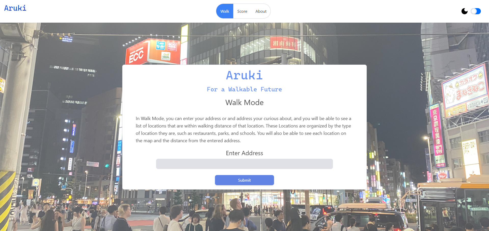
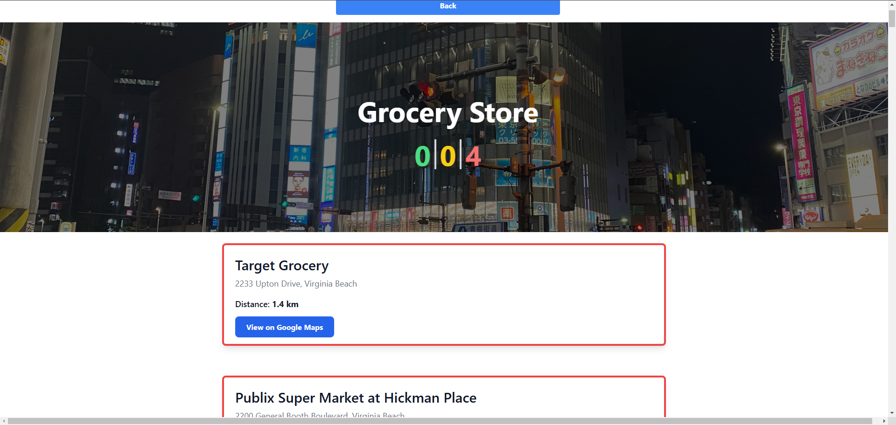
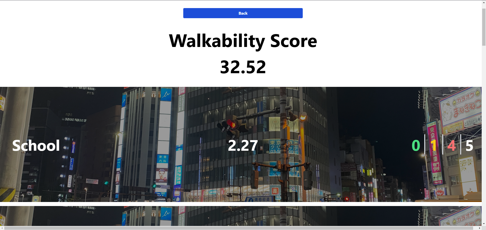

# Aruki Project

## Development Progress
- This project is currently in development.
- The basis of the backend is complete and is pending integration with the Google Maps API.
- The frontend is in the early stages of development and requires further implementation.

## Table of Contents
- [Overview](#overview)
  - [Features](#features)
- [Technical Stack](#technical-stack)
    - [Backend](#backend)
    - [Frontend](#frontend)
    - [Repository Structure](#repository-structure)
- [Getting Started](#getting-started)
    - [Prerequisites](#prerequisites)
    - [Setup](#setup)
- [Usage](#usage)
    - [Walk Mode](#walk-mode)
    - [Score Mode](#score-mode)
- [Screenshots](#screenshots)
- [License](#license)
- [Acknowledgments](#acknowledgments)
- [Contact](#contact)

## Overview
The **Aruki Project** promotes walkable urban environments by analyzing the walkability of user-input locations. The application provides two primary modes of functionality: **Walk** and **Score**.

### Features
- **Walk Mode**: 
  - Users input an address and a category.
  - The backend utilizes the Google Maps API to identify nearby locations within walking distance.
  - These locations are displayed on a map in the frontend using the Google Maps API.

- **Score Mode**:
  - Users input an address and a category.
  - The backend analyzes the walkability of the location and generates a comprehensive walkability score.
  - The score includes category-specific walkability metrics.


---

## Screenshots

### Home Screen


### Walk Mode


### Score Mode


---

## Technical Stack

### Backend
- **Language**: Java 21
- **Framework**: Spring Boot
- **Build Tool**: Maven
- **APIs**:
  - Google Maps API for location data and walking distance analysis
- **Architecture**: RESTful API

### Frontend
- **Framework**: React
- **Styling**: TailwindCSS
- **Integration**: Google Maps API for rendering maps and location markers

### Repository Structure
```
project-root/
|
├── Backend/     # Contains Spring Boot application
│   ├── aruki/   # Base Backend location 
│   ├── aruki/src/main/java/com/aruki/aruki/ # Java source code
│   └── ...
|
├── Frontend/    # Contains React application
│   ├── aruki/   # Base Frontend location
│   ├── aruki/src/     # React source code
│   └── ...
|
└── README.md    # Project documentation
```

---

## Getting Started

### Prerequisites
1. **Java 21**: Ensure Java 21 is installed on your system.
2. **Maven**: Required for building the backend.
3. **Node.js** and **npm**: Needed to run the frontend.
4. **Google Maps API Key**: Obtain a valid API key from the [Google Cloud Console](https://console.cloud.google.com/).

### Setup
1. Clone the repository:
   ```bash
   git clone <repository-url>
   cd project-root
   ```

2. Setup the backend:
   ```bash
   cd Backend/aruki
   mvn clean install
   mvn spring-boot:run
   ```

3. Setup the frontend:
   ```bash
   cd ../../Frontend/aruki
   npm install
   npm start
   ```

4. Configure the API key:
   - Create a `.env` file in both the backend and frontend directories.
   - Add the following environment variables to the `.env` file:
     ```plaintext
     API_KEY=your_google_maps_api_key
     TEST_ADDRESS=your_test_address
     ```

---

## Usage

### Walk Mode
1. Navigate to the application in your browser.
2. Select "Walk Mode."
3. Input an address.
4. View nearby locations within walking distance.

### Score Mode
1. Navigate to the application in your browser.
2. Select "Score Mode."
3. Input an address.
4. View the overall walkability score and category-specific metrics.

---

## Acknowledgments
- **Google Maps API** for powering location and mapping features.
- **Spring Boot** for providing a robust backend framework.
- **React** and **TailwindCSS** for creating a seamless user interface.

---

## Contact
For inquiries or feedback, please contact [packerchase@hotmail.com].

